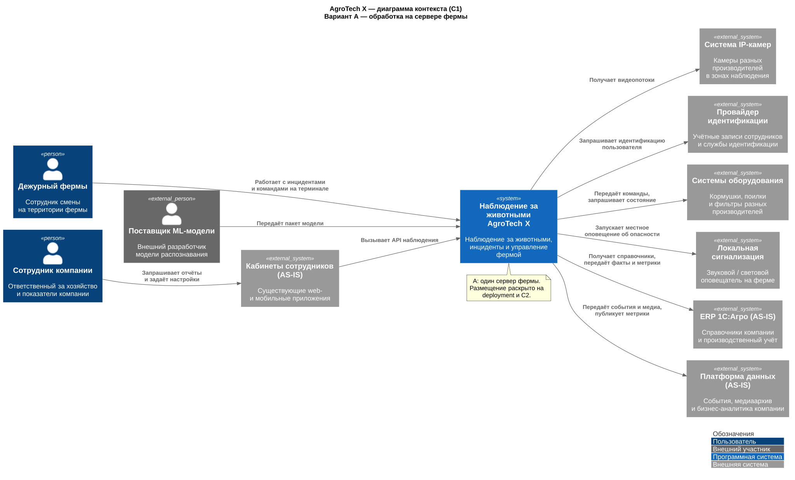
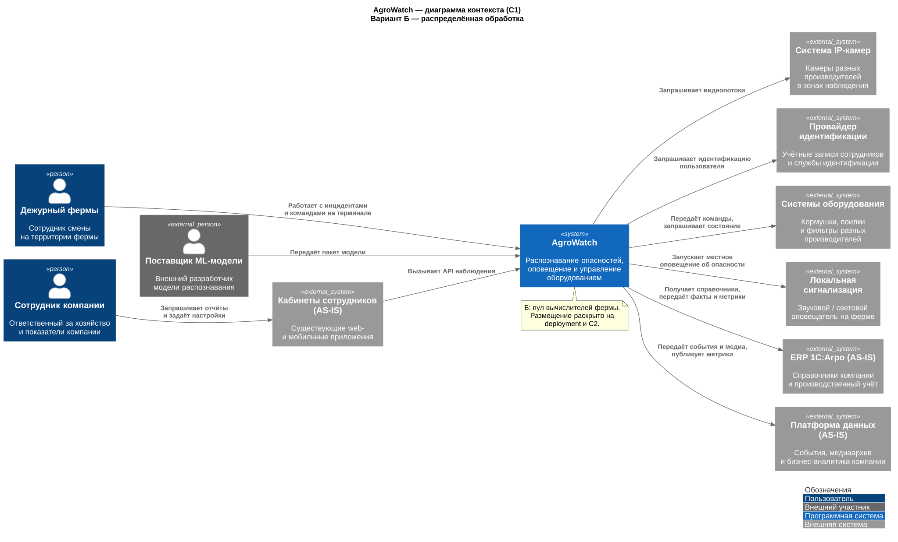

# ADR 001 — альтернативы архитектуры наблюдения

Автор: Святослав Рожков. Дата: 28.09.2026.

Статус: Принято.

Вклад ИИ в подготовку: [AI-log](../AI-LOG.md).

## Функциональные требования

| № | Действующие лица или системы | Сценарий | Порядок действий |
|---|---|---|---|
| F01 | Дежурный, видеоаналитика | Оповестить об опасном поведении | 1. Распознать опасность в кадре. 2. Передать первое наблюдение в оповещение. 3. Показать место и включить сигнал. 4. Дежурный принимает инцидент и фиксирует результат помощи. |
| F02 | Сотрудник фермы, видеоаналитика | Выявить признаки болезни или гибели | 1. Зафиксировать подозрительные признаки. 2. Создать инцидент с кадром и категорией. 3. Сотрудник осматривает животное и записывает результат. |
| F03 | Сотрудник фермы, оборудование | Выдать корм или воду | 1. Задать команду. 2. Проверить права и ограничения на ферме. 3. Исполнить команду. 4. Получить фактический результат; при потере ответа проверить состояние до повтора. |
| F04 | Оборудование, дежурный | Обнаружить неисправность фильтрации | 1. Получить показания. 2. Сравнить с допустимыми значениями. 3. Оповестить дежурного при отклонении. 4. Зафиксировать устранение неисправности. |
| F05 | Сотрудник фермы, система учёта | Уточнить поголовье | 1. Собрать наблюдения животных. 2. Рассчитать количество с учётом повторов. 3. Показать результат сотруднику. 4. Сохранить его корректировку с причиной. |
| F06 | Сотрудник хозяйства, аналитика | Оценить запас корма | 1. Получить остатки и расход. 2. Рассчитать прогноз потребления. 3. Показать прогноз и исходные данные сотруднику. |
| F07 | Сотрудник компании, внешняя система | Получить или добавить метрику | 1. Выбрать базовую метрику либо задать пользовательскую. 2. Определить источник и единицы. 3. Рассчитать значение и передать через API или событие. |
| F08 | Веб- или мобильное приложение | Получить данные через API | 1. Отправить запрос от пользователя. 2. Проверить доступ. 3. Вернуть разрешённые данные выбранной компании и фермы. |
| F09 | Пользователь, сервис доступа | Войти и выполнить разрешённую операцию | 1. Подтвердить личность. 2. Определить роль и область доступа. 3. Разрешить или отклонить операцию. 4. Записать значимое действие в аудит. |

## Нефункциональные требования

| № | Требование |
|---|---|
| R01 | Продолжать работу на ферме и оповещать дежурного при потере интернета. |
| P01 | Оповещать не позднее 5 секунд с момента возникновения опасной ситуации, фиксируемой видеоаналитикой. |
| P02 | Синхронизировать ферму с центром с задержкой не более 10 минут, если связь доступна. |
| P03 | Обрабатывать видео в реальном времени; в задании указаны миллисекунды без точного предела. |
| R02 | Обеспечить целевую доступность 99,95%. |
| S01 | Подключать новые функции и агентов ферм без заданного верхнего предела их количества. |
| C01 | Использовать на ферме не более одного центрального сервера и необходимый набор периферийных вычислителей. |
| C02 | Использовать готовую модель распознавания от партнёров. |
| C03 | Поддерживать камеры разных производителей; учитывать ночь, слепые зоны и искажения объектива «рыбий глаз». |
| C04 | Предусмотреть альтернативу нестабильному Wi-Fi на ферме. |
| C05 | Учитывать ложный подсчёт теней и сложность отслеживания похожих животных; для MVP идеальная точность не требуется. |
| O01 | Дополнительное требование: при отказе любых двух вычислителей сохранять хотя бы одну обработку каждой камеры. Доставка тревоги и её задержка проверяются отдельно. |

Полный перечень: [матрица требований](../appendix/requirements.md).

## Контекст и задача

Нужно выбрать место обработки видеопотоков, сохранив локальное оповещение при отсутствии интернета. [Матрица требований](../appendix/requirements.md) отделяет условия задания от допущений.

Расчётный пример: **16 камер**, число задано нами для сравнения, а не заказчиком. В Б три обработки каждой камеры дают **48 обработок на 50 слотах**; это резервирование вычислителей, не голосование моделей. Любое валидное обнаружение сразу вызывает тревогу. 5 секунд включают видеозахват, распознавание и доставку; достижение ещё нужно измерить.

## Альтернатива А — один сервер фермы

[PNG](../Task1/diagrams/c1-variant-a.png) · [PlantUML](../Task1/diagrams/c1-variant-a.puml)

Один сервер принимает 16 потоков, выполняет модель, ведёт локальный журнал и доменные модули. Тревога отправляется напрямую терминалу и сигнализации; фоновая запись не задерживает её. Потеря интернета не мешает ферме. Отказ сервера останавливает распознавание всех камер.

## Альтернатива Б — распределённый пул

[PNG](../Task1/diagrams/c1-variant-b.png) · [PlantUML](../Task1/diagrams/c1-variant-b.puml)

Пять edge-вычислителей, по 10 параллельных обработок на каждом с ресурсным резервом для Kafka и доменных процессов. Каждая камера назначена трём разным узлам. При любых двух отказах хотя бы один из трёх обработчиков остаётся; сохраняется покрытие камер без переподключения последней копии.

Наблюдение проходит через локальную Kafka к оповещению; терминал и сирена получают его независимо. Критичные топики RF=5/minISR=3, acks=all. После любых двух отказов из пяти синхронных реплик остаются три; возможны паузы выбора лидера и переназначения потребителей. При недоступной Kafka новые тревоги задерживаются. Центр догоняет историю через MirrorMaker 2. [Пределы гарантий](../appendix/local-kafka-decision-review.md).

## Решение

Для фермы с нестабильной внешней связью и требованием продолжать наблюдение при отказе двух вычислителей выбран распределённый вариант Б вместо одного сервера А. Он сохраняет обработку камер ценой дополнительных устройств, репликации и более сложной эксплуатации. Подробности: [ADR 002](002-compute-pool.md), [ADR 003](003-local-kafka.md). Контексты C1 намеренно совпадают: пользователи и соседние системы одинаковы; варианты различаются внутренним устройством и размещением, что показывают схемы выше и C2.

## Недостатки, ограничения, риски

По единой условной формуле для 16 камер базовое железо А — 190 тыс. ₽, Б — 650 тыс. ₽ при узле 130 тыс. ₽. Это **иллюстрация чувствительности, не смета и не подтверждённая цена**; полная формула и исключения — в [расчёте](../appendix/compute-economics-5x10-vs-16x3.md).

Оба варианта зависят от камеры, её питания и сети. Б не устраняет общие отказы сети и получателей, ошибки одинаковой модели и ограничения журнала. Доступность 99,95% не доказана числом узлов. Выбор edge под C01 означает отсутствие выделенного центрального сервера в Б: доменные процессы работают на периферийных вычислителях, действительно обрабатывающих камеры; это явное толкование ограничения задания.

## Использование существующей платформы

| Система AS-IS | Использование в обоих вариантах |
|---|---|
| React web / Flutter mobile | Существующий кабинет вызывает новый API наблюдения; новый локальный терминал спроектирован отдельно |
| ERP 1С:Агро | Справочники компании и обмен производственными фактами |
| Центральная Kafka | Выделенные топики наблюдения и интеграций; ресурс и ACL проверяются до подключения |
| MinIO | Медиа и артефакты моделей через новый медиасервис |
| ClickHouse / Power BI | Агрегаты для существующего аналитического контура, без прямого доступа к оперативным БД |

На C1 «Платформа данных (AS-IS)» обобщает последние три инфраструктурных системы. Они уже показаны в исходном ландшафте задания; их фактическая ёмкость и пригодность к новым SLA не заданы. Переиспользование — проектное предложение, не подтверждение свободных ресурсов.

## Дополнительные виды

[Размещение, сеть и проверка доступа](../Task1/implementation-views.md) раскрывают оба варианта. Контейнеры и протоколы приведены в [ADR 006](006-integrations.md).
