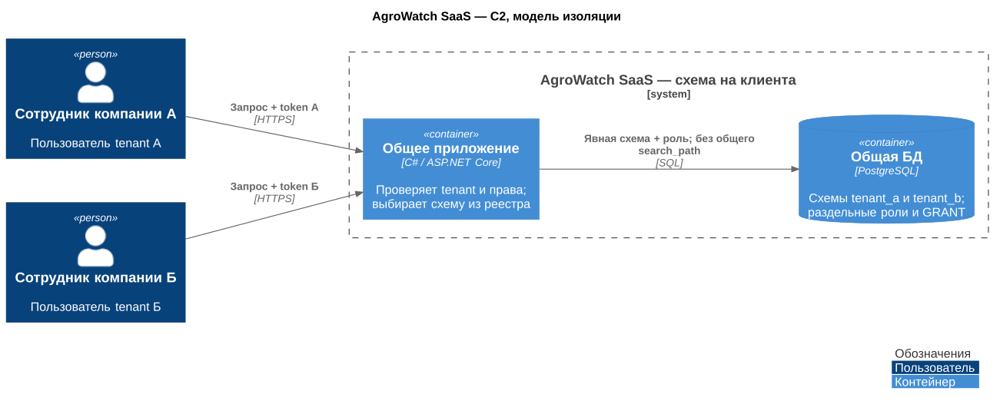
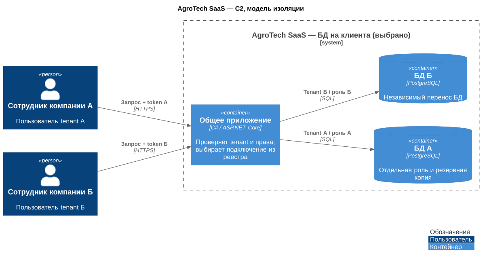
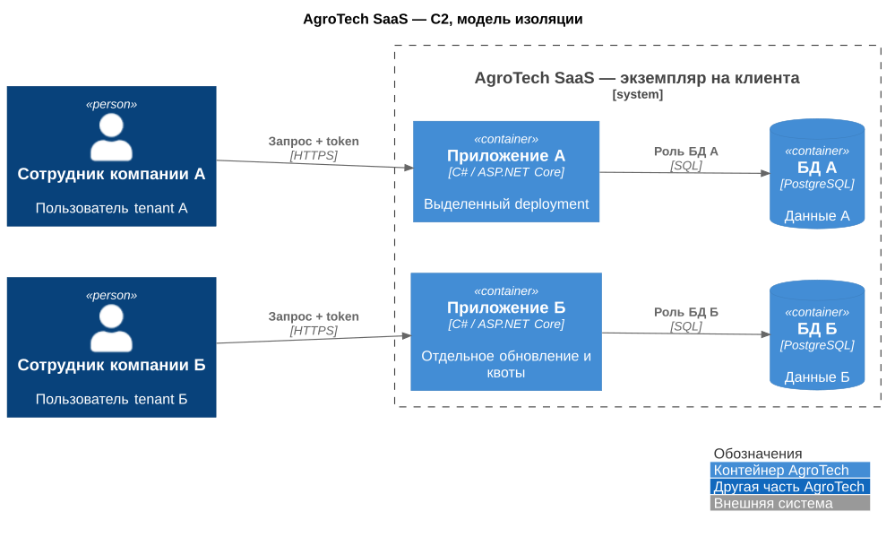
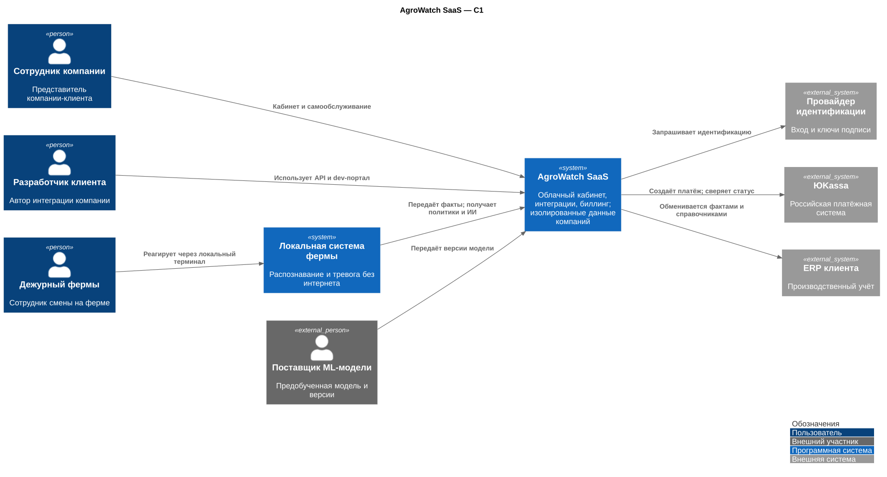
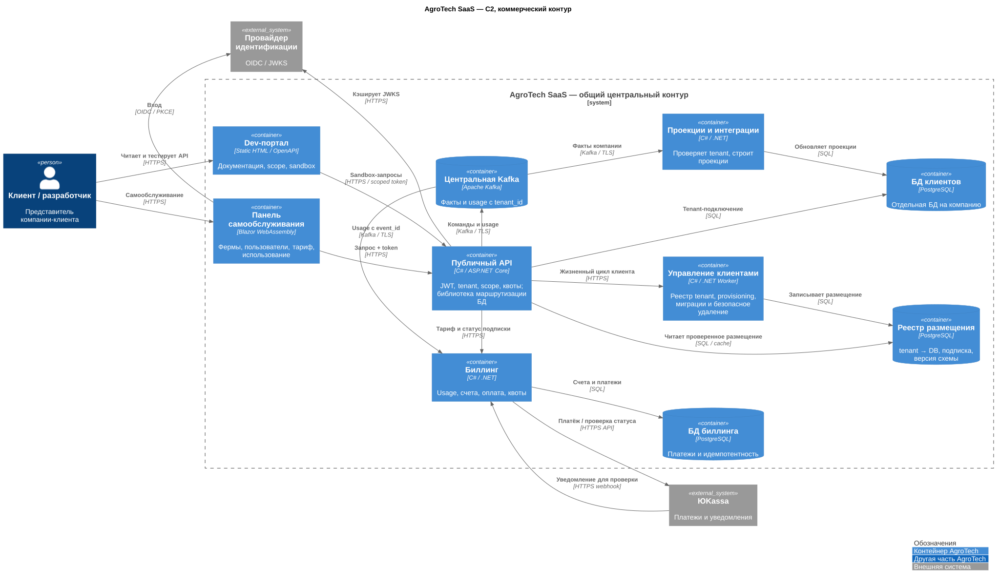
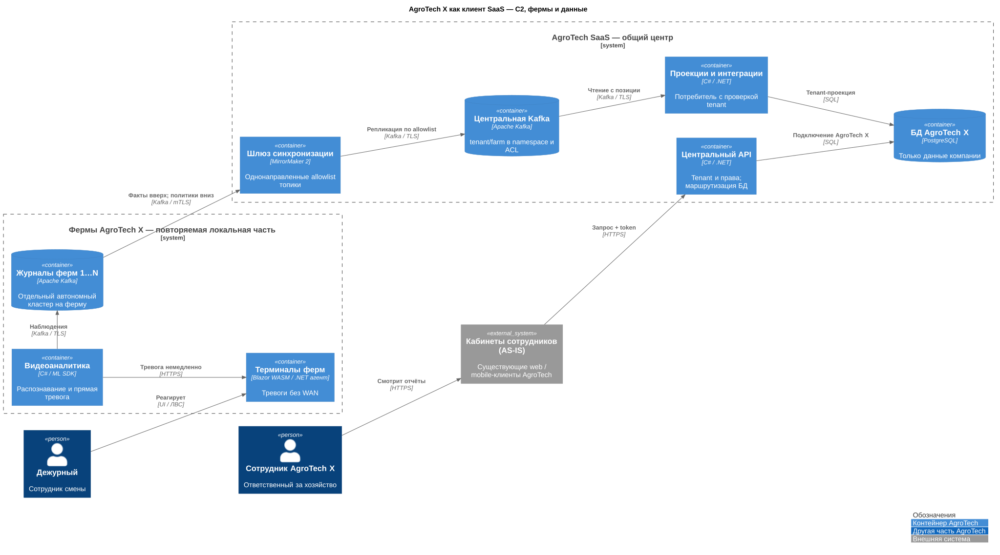

# ADR 004 — изоляция SaaS по базе данных клиента

Автор: Святослав Рожков. Дата: 28.09.2026.

Статус: Принято.

Вклад ИИ в подготовку: [AI-log](../AI-LOG.md).

## Функциональные требования

| № | Участники | Сценарий | Порядок действий |
|---|---|---|---|
| F08–F09 | Клиент, платформа | Подключить компанию | 1. Зарегистрировать компанию. 2. Создать её БД и права. 3. Подключить фермы. 4. Открыть доступ к кабинету. |
| S01 / Task5 | Клиент, биллинг | Оплатить использование | 1. Выбрать тариф. 2. Учесть объём использования. 3. Выставить счёт. 4. Получить и сверить подтверждение оплаты. |

## Нефункциональные требования

| № | Требование |
|---|---|
| Task5: изоляция | Данные компании доступны только её пользователям и уполномоченным сервисам. |
| Task5: рост | Подключение компаний и увеличение нагрузки не требуют остановки всех клиентов. |
| R01 / P02 | Ферма работает без интернета; при доступной связи обмен с центром укладывается в 10 минут. |
| Task5: учёт оплаты | Повтор платёжного уведомления не создаёт повторное начисление; использование связано с конкретным клиентом. |

## Контекст

SaaS развивает выбранный в [ADR 005](005-architecture-choice.md) вариант Б. Клиент (tenant) — компания с несколькими фермами. Предполагаем десятки крупных клиентов на раннем этапе; это гипотеза, не данность задания.

## Альтернативы

| Модель | Выигрыш | Цена и ограничения |
|---|---|---|
| Схема на клиента в общей БД | Одна инсталляция БД, меньше соединений/инфраструктуры | Нужны отдельные роли и явный выбор схемы в запросах; ошибка прав или выбора схемы открывает чужие данные; резервирование и восстановление обычно общие |
| БД на клиента, общее приложение | Независимая роль/экспорт/перенос клиента; легче разнести ресурсы | Обновления структуры и резервные копии каждой БД; лимиты соединений; общий сервер всё ещё общий домен отказа |
| Отдельный экземпляр приложения и БД | Изоляция вычислений и релизов, независимые квоты | Отдельные установки и обновления на каждого клиента; дорого для небольших компаний |

Выделенный экземпляр приложения и БД остаётся корпоративной опцией для клиентов с требованиями к изоляции вычислений и релизов.

## Решение

Выбрана **БД на клиента при общем приложении**. Реестр размещения и общая библиотека выбирают подключение только из проверенного tenant-контекста. Роли БД ограничены соответствующим клиентом. Принцип применяется в периметре каждого сервиса: биллинг владеет своими таблицами, доменные сервисы — своими; общей схемы для произвольной записи всеми сервисами нет.

## Недостатки, ограничения, риски

Правильного выбора БД недостаточно: чужие данные могут попасть в API, сообщения, кэш или ссылки на файлы. Для каждого пути проверяем, что пользователь компании А не получает данные компании Б. Восстановление PostgreSQL на выбранный момент времени (PITR) при общем кластере требует поднять его отдельную копию, извлечь нужную БД и перенести клиента. Для этого нужны дополнительное место и время.

Создание и удаление клиентских БД, изменение их структуры, резервные копии и учёт версий требуют автоматизации. Без этих механизмов эксплуатационная цена растёт. [Схемы моделей и To-Be](../Task5/README.md), [коммерческий контур](../Task5/saas-commercial.md).

## Схемы изоляции и целевой платформы

Модели ниже — C2-схемы границ изоляции; общая функциональная часть показана отдельно.

## Схема на клиента

[PNG](../Task5/diagrams/isolation-schema.png) · [PlantUML](../Task5/diagrams/isolation-schema.puml)

## БД на клиента — выбранная модель

[PNG](../Task5/diagrams/isolation-database.png) · [PlantUML](../Task5/diagrams/isolation-database.puml)

## Экземпляр на клиента

[PNG](../Task5/diagrams/isolation-instance.png) · [PlantUML](../Task5/diagrams/isolation-instance.puml)

## Контекст SaaS

[PNG](../Task5/diagrams/c1-saas.png) · [PlantUML](../Task5/diagrams/c1-saas.puml)

## Контейнеры коммерческого контура

[PNG](../Task5/diagrams/c2-saas-tobe.png) · [PlantUML](../Task5/diagrams/c2-saas-tobe.puml)

Этот вид дополняет [C2 центра](../Task2/architecture.md): там раскрыты синхронизация ферм, ИИ и медиасервис, здесь — управление клиентами и коммерция. Каждый контейнер сохраняет то же имя и назначение.

## AgroTech X — компания-клиент с несколькими фермами

[PNG](../Task5/diagrams/c2-agrotech-client.png) · [PlantUML](../Task5/diagrams/c2-agrotech-client.puml)

Дежурный работает через локальный терминал даже при потере WAN. Центральный кабинет объединяет независимо собираемые микрофронтенды в общей оболочке: инциденты, оборудование, аналитика и управление SaaS. Границы и выпуск — [ADR 007](007-microfrontends.md). Одной БД клиента недостаточно для изоляции: проверяется tenant на всех каналах и в медиа.

## Трассировка

Task5: три модели — первые три C2; итоговые C1/C2 — далее; AgroTech X с фермами — последний вид. Подписки, российский провайдер, scope, dev-портал, самообслуживание, масштабирование и usage — [коммерческая модель](../Task5/saas-commercial.md). F07–F09, R01, P02, S01 покрываются этими контрактами; фактические SLO проверяются при реализации.

## Итог выбора

Для предполагаемых десятков компаний выбираем отдельную БД клиента при общем приложении вместо схем в одной БД или отдельных установок всей системы. Это упрощает перенос и экспорт данных клиента, но требует автоматизации обслуживания множества баз и проверки изоляции за пределами БД.
