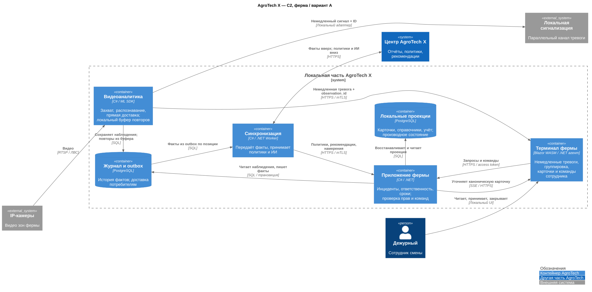
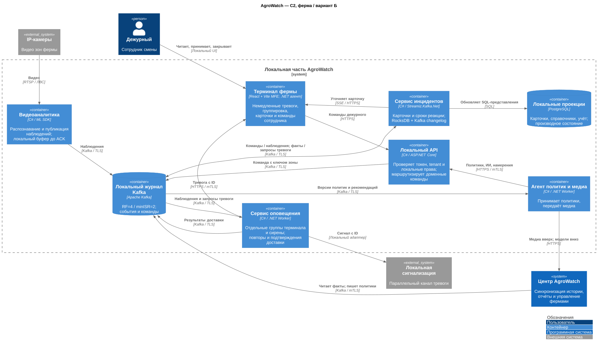
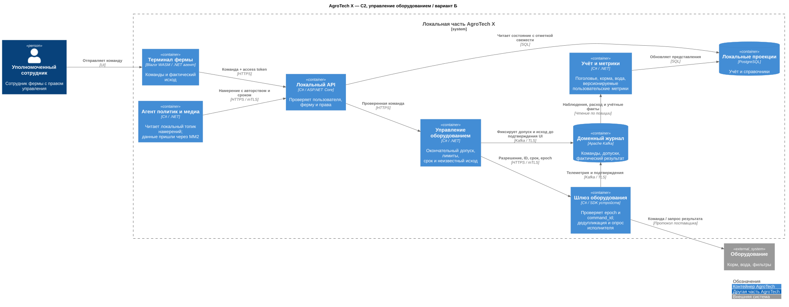
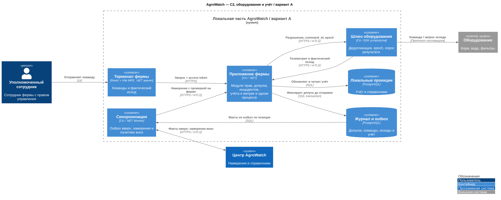
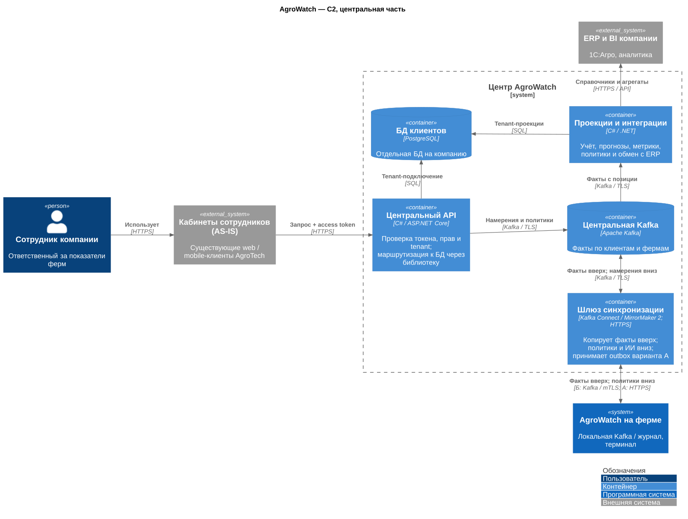
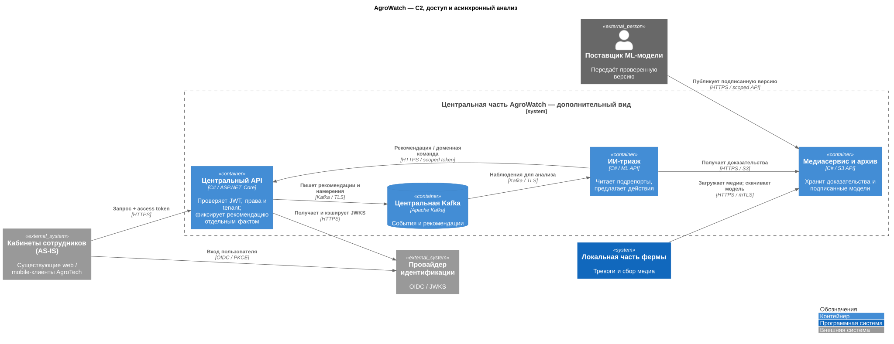
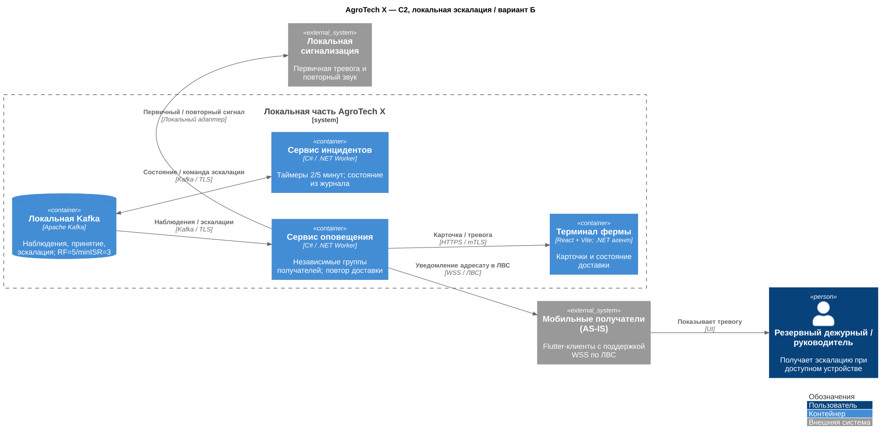

# ADR 006 — протоколы и границы интеграций

Автор: Святослав Рожков. Дата: 28.09.2026.

Статус: Принято.

## Функциональные требования

| № | Участники | Use Case | Шаги |
|---|---|---|---|
| F01–F02 | Камера, дежурный | Обнаружить опасность | Получить кадры → распознать → немедленно оповестить → принять и устранить |
| F03–F04 | Сотрудник, оборудование | Управлять кормом и водой | Проверить права и лимиты на ферме → исполнить → выяснить фактический исход |
| F05–F09 | Учёт, сотрудник компании | Управлять хозяйством | Сформировать учёт и метрики → показать в web/mobile с проверкой прав |

## Нефункциональные требования

| № | Требование |
|---|---|
| R01 / P01 | Локальная работа без WAN; тревога ≤ 5 с от возникновения ситуации |
| P02 / R02 | Синхронизация ≤ 10 мин при связи; целевая доступность 99,95% |
| C01–C05 | Один центральный сервер максимум плюс edge; готовая ML-модель; разные камеры, нестабильная сеть и ошибки распознавания |

## Контекст

Ферма должна работать без интернета. В Б принят единый путь через локальную Kafka; время восстановления журнала входит в бюджет тревоги. Прикладные границы одинаковы у А и Б; различаются размещение, хранение и механизмы координации.

## Ограниченные контексты

Одинаковы для А и Б; размещение меняется, бизнес-инварианты — нет.

| Контекст | Владение и правила | Контракт / связь |
|---|---|---|
| Наблюдение | Кадры, версия модели, признаки, observation_id | Published Language: ObservationRecorded; адаптер к модели и камере |
| Инциденты | Зона, окно 60 с, подрепорты, один ответственный, исход | Customer/Supplier: получает наблюдения, выдаёт команды доставки |
| Оповещение | Попытки и подтверждения каждого получателя | Б: независимый потребитель Kafka; ACK устройства не принятие человеком |
| Оборудование | Лимиты, допуск на ферме, command_id и неизвестный исход | Anti-Corruption Layer: драйверы поставщиков |
| Учёт | Подтверждённое поголовье и остатки кормов | Наблюдения не меняют учёт без правила / корректировки |
| Аналитика | Прогнозы потребления, базовые и пользовательские метрики | Downstream-проекции учёта и телеметрии |
| ИИ-триаж | Рекомендации с версией модели и доказательствами | Анализ асинхронно; команды через тот же доменный API |
| Клиенты и доступ | Tenant, фермы, права, сроки, регистрация | Open Host Service: API политик / provisioning |
| Биллинг | Тариф, usage, счёт, платёж, квота | Отдельная модель; опубликованные события usage |

Между наблюдением и инцидентами нет общей транзакции. В Б оповещение читает первое наблюдение из Kafka, не ждёт канонического инцидента; в А используется прямая доставка. Терминал группирует локальную карточку, затем связывает её с канонической по observation_id. В А часть контекстов — модули одного приложения; в Б — отдельные процессы. Kafka и PostgreSQL не являются бизнес-контекстами.

[Требования](../appendix/requirements.md) · [Инцидент](../appendix/incident-event-contract.md) · [Команды](../appendix/equipment-command-contract.md).

## Риски вариантов А и Б

| Риск | А | Б | Проверка / мера |
|---|---|---|---|
| Потеря вычислителя | Все 16 камер теряют анализ | При любых двух остаётся копия каждой камеры | Отключить узлы под полной нагрузкой, проверить результаты и тревогу |
| Kafka не принимает запись | Не применяется | При ISR<3 новые тревоги и команды задерживаются | Буфер pending, мониторинг недоставки, блок физических допусков |
| Потеря истории | Локальный диск до копии в центр | Нереплицированный хвост; общие отказы сверх модели двух устройств | Нет абсолютной гарантии; архив в центре, проверка restore |
| Терминал отказал | Сирена остаётся при независимом канале | То же | Проверить отдельную трассу и питание; сирена не заменяет подробную карточку |
| Общая сеть / питание | Остановка | Остановка возможна несмотря на 5 узлов | Раздельные домены отказа, UPS, план кабельной сети |
| Одинаковая ошибка модели | Возможна | Три копии могут одинаково ошибиться | Размеченные видео: ночь, тени, fisheye, похожие животные |
| Зависший consumer | Не обработал событие | Нулевой lag может скрыть ошибку формата | Сквозной синтетический эпизод до терминала, quarantine/метрики |
| Split-brain команды | Один модуль, но повторы транспорта | Смена владельца после сбоя | Lease + монотонный epoch в шлюзе; без поддержки только ручное восстановление |
| Отказ проекционной БД | UI показывает устаревшие данные | Аналогично при восстановлении на другом узле | Свежесть/версия видимы; оповещение не зависит от проекции |

99,95% и пять секунд — критерии приёмки, а не достигнутый результат. Архитектура обеспечивает предполагаемые пути деградации; реализация и испытания в этот пакет не входят.

В Б при ISR<3 новые тревоги и эскалация задерживаются; уже доставленный сигнал сохраняется. При отказе терминала отдельная группа оповещения продолжает доставку сирене при исправной Kafka и ЛВС. В А таймеры терминала деградируют при его отказе. Резервный сотрудник/руководитель вне ЛВС без доступного WAN не получает обещания доставки: требуется местный регламент реагирования на повторный звук.

## Решение

[Таблица контрактов](../Task2/integrations.md): RTSP для видео; HTTPS для UI/API и последнего участка доставки получателю; в Б локальная Kafka для событий и межсервисных команд; в А SQL/outbox и прямое оповещение. MM2 соединяет автономные кластеры, HTTPS/S3 переносит медиа. UI и ИИ проходят один доменный допуск; HTTP-постановка команды не равна исполнению.

## Альтернативы

Обязательный вызов центра нарушает R01. Видео в Kafka перегружает журнал. Прямая тревога рядом с журналом потребовала бы двух механизмов доставки; в Б выбран единый путь и усилена репликация по [ADR 003](003-local-kafka.md). REST вместо MM2 потребовал бы собственного cursor, повторов и сверки состояния.

## Недостатки, ограничения, риски

Kafka входит в критический путь: выбор лидера и rebalance входят в пять секунд; при отказе кластера новые тревоги задерживаются. MM2 не гарантирует P02 без сетевого бюджета. Kafka-транзакции не обеспечивают однократность звука или выдачи корма: получатели сохраняют ID и проверяют фактический исход. Новые допуски останавливаются, если журнал нельзя подтвердить.

## Схемы принятой интеграции и альтернативы

Схемы — C2: приложения и хранилища. Число экземпляров и размещение показаны отдельно в [ADR 001](001-architecture-variants.md).

## Стек нового решения

Фронтенд локального терминала и панели самообслуживания — **React + Vite**. Бэкенд — **C#/.NET**: ASP.NET Core для API, .NET Worker для фоновых процессов и локального агента терминала. Агент принимает тревоги от локального оповещения, хранит состояние и ведёт таймеры независимо от браузера. Существующие React/Flutter-клиенты подключаются к API без переписывания.

Видеоаналитика также имеет C#-обвязку. [ONNX Runtime предоставляет C# API](https://onnxruntime.ai/docs/get-started/with-csharp.html), но формат партнёрской модели пока неизвестен: ONNX/нативный SDK — кандидат, совместимость, качество и GPU-бюджет проверяются до реализации. Формат модели не меняем без проверки поставщика. Kafka, PostgreSQL и клиентские системы сохраняют свои технологии.

## Вариант А: локальный сервер

[PNG](../Task2/diagrams/c2-a-alternative.png) · [PlantUML](../Task2/diagrams/c2-a-alternative.puml)

Видеоаналитика посылает срочную тревогу напрямую в оба локальных получателя. Приложение фермы объединяет инциденты и учёт; транзакция PostgreSQL фиксирует факт и outbox. Синхронизация читает outbox независимо от оповещения.

## Вариант Б: распределённая обработка

[PNG](../Task2/diagrams/c2-b-primary.png) · [PlantUML](../Task2/diagrams/c2-b-primary.puml)

Видеоаналитика на пяти узлах публикует наблюдения в Kafka из устойчивого буфера. Сервис оповещения читает их сразу, независимо от сервиса инцидентов и ИИ. Отдельные consumer groups доставляют терминалу и сирене: сбой одного получателя не блокирует другого. Сервис инцидентов уточняет каноническое состояние. При недоступной Kafka новые тревоги остаются pending; ранее полученные карточки видимы. Принятие/закрытие подтверждается доменным фактом, а не HTTP 202.

## Управление оборудованием и учёт

[PNG](../Task2/diagrams/c2-equipment.png) · [PlantUML](../Task2/diagrams/c2-equipment.puml)

[PNG](../Task2/diagrams/c2-equipment-a.png) · [PlantUML](../Task2/diagrams/c2-equipment-a.puml).

В А API, инциденты, оборудование и учёт — модули Приложения фермы; шлюз — отдельный процесс. В Б это сервисы на том же edge-пуле. Подробности допуска и fencing в [Task3](../Task3/README.md). Телеметрия фильтров, корма и воды идёт через шлюз, учёт строит остатки и поголовье, центр рассчитывает прогноз потребления.

## Центральная часть

[PNG](../Task2/diagrams/c2-center.png) · [PlantUML](../Task2/diagrams/c2-center.puml)

MM2 развёрнут в центре и читает доступные ферменные брокеры через защищённую сеть. Для варианта А шлюз принимает HTTPS-пакеты outbox и подтверждает после устойчивой записи. API и потребители используют общий проверяемый модуль tenant-маршрутизации, но каждый сервис сохраняет владение своими данными. Блок БД клиентов — логическая совокупность БД в периметре сервисов, не разрешение всем сервисам писать любые таблицы.

ИИ получает факты и ссылки на медиа; рекомендация публикуется через API отдельным фактом и доезжает вниз. Базовые инциденты не зависят от ИИ. Версии политик и отзывов доставляются как данные, JWKS кэшируются API; собственно проверка подписи и разрешений локальна.

## Доступ и асинхронный ИИ в центре

[PNG](../Task2/diagrams/c2-center-ai-access.png) · [PlantUML](../Task2/diagrams/c2-center-ai-access.puml).

## Политики, намерения и эскалация

В Б выбран один путь вниз: центральный API → центральная Kafka → MM2 в центре → allowlist-топики локальной Kafka → агент политик и медиа → локальный API → топик команды Kafka → нужный домен. Прямого центрального допуска оборудования нет. HTTPS агента к центру используется для файлов медиа/моделей; права и команды получают через топики. В А тот же шлюз синхронизации обменивается outbox и входящими данными по HTTPS, затем вызывает локальное приложение.

В Б оповещение потребляет наблюдения и команды эскалации из Kafka; таймеры сервиса инцидентов публикуют эскалацию в тот же локальный кластер. Состояние таймеров восстанавливается из журнала. При недоступном кластере новые сигналы и эскалация задерживаются; уже активный сигнал не исчезает. В А таймеры остаются в агенте терминала. [Ограничения каналов и сроки](../appendix/local-control-and-offline-access.md).

Поставщик модели загружает подписанную версию в центральный реестр артефактов (часть медиасервиса). Агент скачивает пакет по HTTPS, проверяет подпись и совместимость, развёртывает по одной копии камеры с rollback. Контроллер развёртывания работает в центре; действующее назначение кэшировано на ферме и без WAN не исчезает.

[PNG](../Task2/diagrams/c2-escalation.png) · [PlantUML](../Task2/diagrams/c2-escalation.puml).
