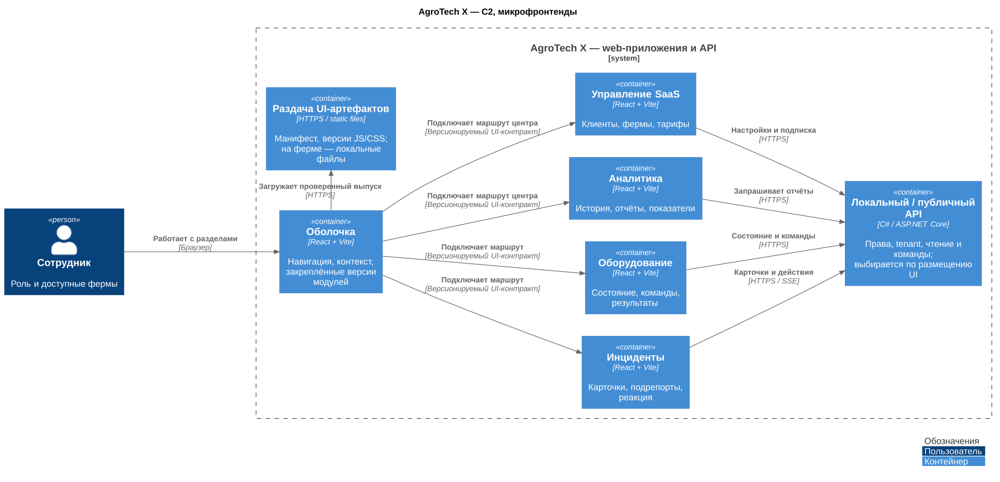

# ADR 007 — микрофронтенды React + Vite

Автор: Святослав Рожков. Дата: 28.09.2026.

Статус: Принято.

## Контекст и требования

Разделы интерфейса развиваются независимо. Границы сборок и контрактов задаём сразу, чтобы последующее выделение поставок не требовало переработки общего состояния и зависимостей. Это принятое проектное решение, а не требование курса о количестве frontend-команд.

| Требование / сценарий | Решение |
|---|---|
| F01–F02: прочитать тревогу, принять и закрыть инцидент | Микрофронтенд «Инциденты» на локальном терминале |
| F03–F04: управлять оборудованием | Микрофронтенд «Оборудование», команды через локальный API |
| F07–F09 и Task5: отчёты и самообслуживание | «Аналитика» и «Управление SaaS» в центральном кабинете |
| R01: потеря интернета | Оболочка и необходимые модули доступны на ферме локально |
| P01 / R02: срочная тревога и доступность | Доставка агенту и сирене не зависит от загрузки браузерных модулей; показ карточки проверяется отдельно |
| Развитие продукта | Независимые сборки и выпуск совместимых версий модулей |

## Решение

Фронтенд — микрофронтенды **React + Vite**; backend и агент терминала — **C#/.NET**. Оболочка отвечает за навигацию, загрузку модулей и передачу контекста пользователя, компании и фермы. Доменные правила остаются на backend.

| Микрофронтенд | Ответственность | Размещение |
|---|---|---|
| Инциденты | Тревоги, подрепорты, принятие, закрытие | Терминал фермы; центральный кабинет для просмотра истории |
| Оборудование | Состояние устройств, команды, результаты | Терминал; центральный кабинет через существующий путь намерений на ферму |
| Аналитика | История, отчёты, показатели | Центральный кабинет |
| Управление SaaS | Клиенты, фермы, пользователи, тарифы и биллинг | Центральный кабинет |

У модулей отдельные сборки и версии. Оболочка выбирает совместимые версии по манифесту выпуска; конкретная библиотека композиции выбирается при реализации. Версионируются интерфейс подключения, события оболочки, API и библиотека оформления. Модули не импортируют внутренние компоненты друг друга и не используют общий изменяемый доменный store. Состояние предметной области читается через API; React и общие runtime-зависимости согласуются в манифесте.

Контекст оболочки не является разрешением доступа: .NET API повторно проверяет пользователя, tenant, scope и локальные ограничения. Браузер не подключается к Kafka. Команды поступают через API в согласованный путь Kafka; HTTP 202 не означает исполнение. Существующие React/Flutter-клиенты AS-IS сохраняются.

## Автономность и обновления

На ферме shell, манифест, JS/CSS, шрифты и остальные необходимые ресурсы хранятся локально. Загрузка раздела и холодный запуск браузера не требуют WAN или публичного CDN. Локальная раздача артефактов размещается рядом с агентом терминала; центральный кабинет использует центральное хранилище артефактов.

Новая версия сначала полностью загружается в отдельный каталог и проверяется по хешам, подписи и совместимости. Только затем атомарно переключается указатель активного манифеста. Частичная загрузка или несовместимость оставляют предыдущий комплект активным; его файлы сохраняются для отката. Независимое обновление модуля меняет только его версию в проверенном манифесте, а несовместимое изменение требует согласованного выпуска.

Открытая сессия использует закреплённые версии до безопасной перезагрузки: обновление не обрывает принятие инцидента или ввод команды. Повтор команды использует прежний ID. Ошибка загрузки модуля показывается явно и изолируется от соседних маршрутов; отказ оболочки или общего runtime всё ещё может нарушить весь UI. Агент и сирена продолжают получать тревоги независимо от браузера, но потеря экрана остаётся отдельным риском.

## Альтернативы и последствия

Модульное React-приложение с единой сборкой проще в эксплуатации, но связывает выпуск разделов. Полностью отдельные сайты дают независимые релизы, но дублируют навигацию и пользовательский контекст. Выбрана общая оболочка с микрофронтендами ради независимых поставок с начала проекта.

Цена — дополнительные сборки, контракты, проверки сочетаний версий и локальная доставка артефактов. Разбиение по доменам ограничивает сложность; отдельный микрофронтенд для каждого backend-сервиса не требуется. Общая библиотека UI — версионируемая зависимость, а не новый сетевой сервис.

## Схема

[PNG](../Task2/diagrams/c2-microfrontends.png) · [PlantUML](../Task2/diagrams/c2-microfrontends.puml)

На общих C2 блок «Терминал фермы» объединяет web-часть и .NET-агент; «Панель самообслуживания» объединяет центральную оболочку и модули. Этот вид раскрывает только независимо собираемые web-приложения. Он применяется к обоим backend-вариантам; состав локального и центрального выпуска различается по таблице выше.

## Проверка решения

При реализации сравниваются пары: полная/оборванная загрузка обновления; совместимый/несовместимый модуль; запуск с WAN/без WAN и пустым браузерным кешем. В отрицательных случаях обновления продолжает работать прежний комплект. Дополнительно проверяются сбой одного модуля при открытом инциденте, откат без повтора команды и сохранение сигнала при падении браузера. Это критерии испытаний; в учебном пакете проверяются документы и рендеры, исполняемого frontend-прототипа нет.
