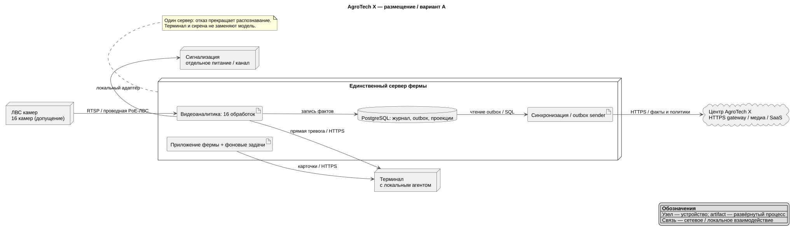
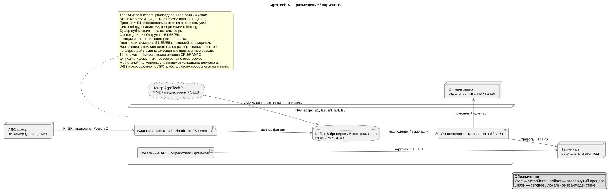
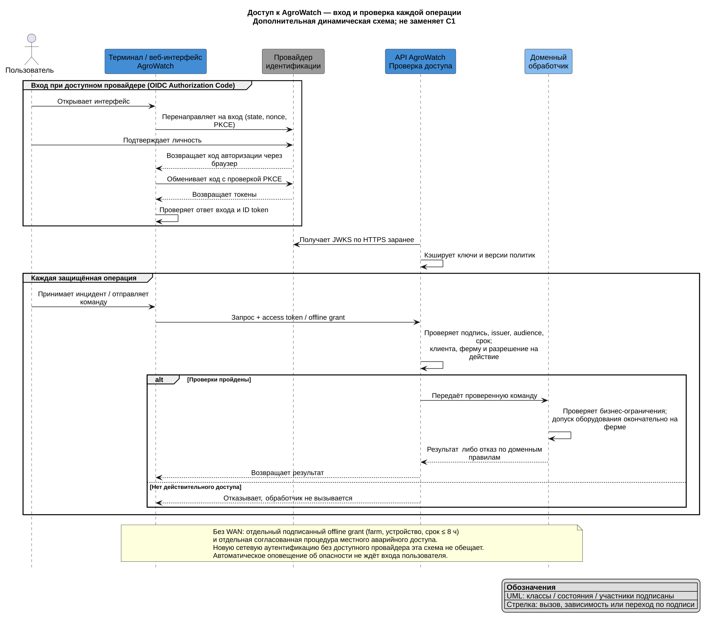
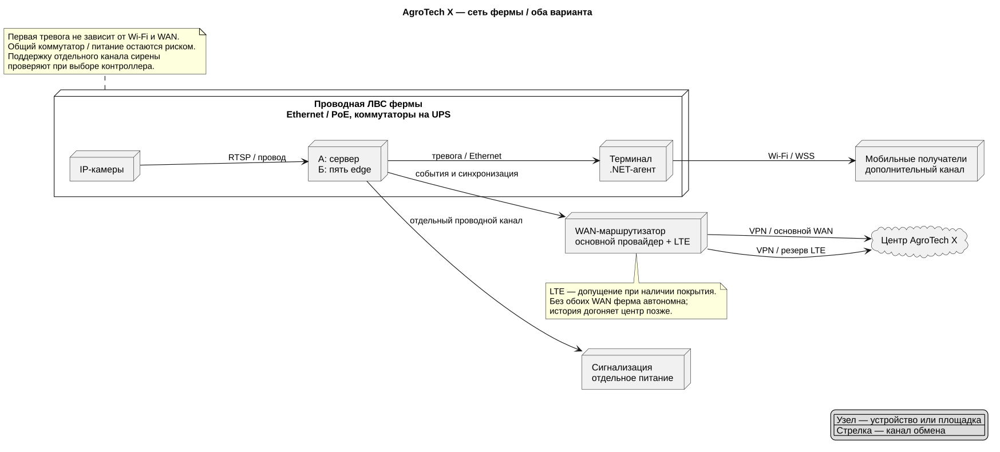

# AgroWatch: размещение, сеть и доступ

Дополнительные виды к [ADR 001](../ADR/001-architecture-variants.md). Они уточняют физическое размещение и взаимодействия; контекстные диаграммы C1 остаются в ADR.

## Размещение варианта А

[PNG](diagrams/deployment-a.png) · [PlantUML](diagrams/deployment-a.puml)

## Размещение варианта Б

[PNG](diagrams/deployment-b.png) · [PlantUML](diagrams/deployment-b.puml)

## Вход и проверка доступа

[PNG](diagrams/access-flow.png) · [PlantUML](diagrams/access-flow.puml)

Провайдер подтверждает личность; API проверяет токен и права на каждой операции. Он получает и кэширует JWKS. На ферму доставляются подписанные версии политик и офлайн-прав; новые ключи должны быть получены до отключения. Неизвестный ключ или истёкшие права не дают доступ. Автоматическая тревога не зависит от пользовательского входа.

## Сеть и автономность

[PNG](diagrams/network.png) · [PlantUML](diagrams/network.puml)

Камеры, вычислители и стационарный терминал соединены проводной Ethernet/PoE-сетью. Wi-Fi — дополнительный путь к мобильным получателям, а не условие первой тревоги. Сигнализация требует отдельного проводного канала и питания; поддержку несколькими вычислителями и подтверждение по ID проверяют при выборе контроллера. Общие коммутаторы, питание и одиночное подключение камеры остаются рисками, которые число вычислителей не устраняет.

Для пилота предусмотрен резервный LTE-маршрут через VPN при наличии покрытия оператора. Медиа уступает приоритет событиям. При потере обоих WAN тревога остаётся местной; история накапливается до восстановления. P02 ≤ 10 мин проверяется при доступной связи с учётом пропускной способности и очереди.
