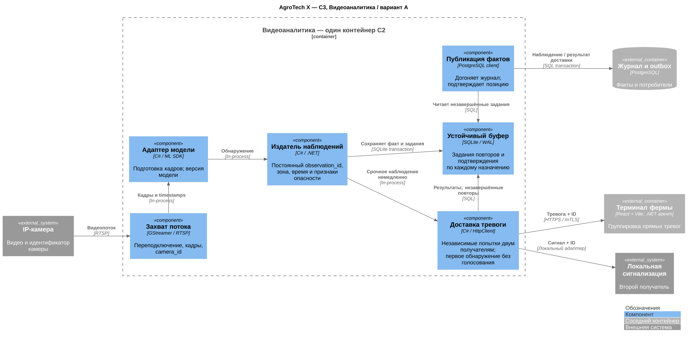
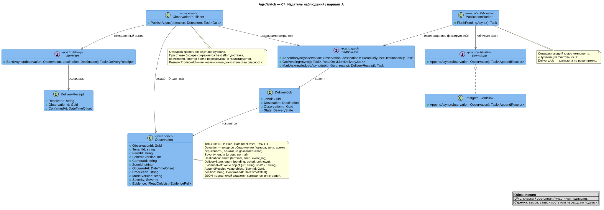
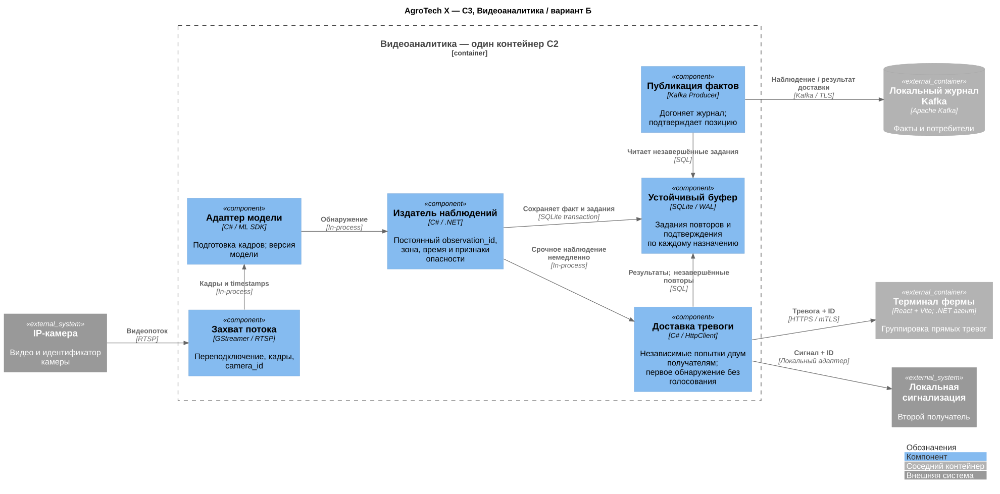
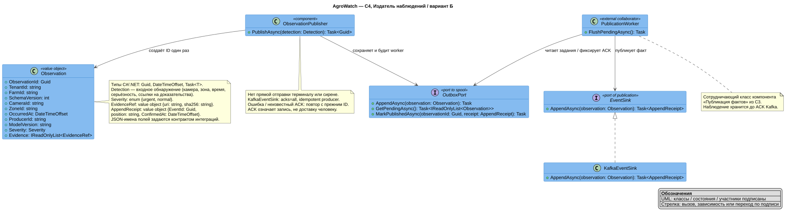
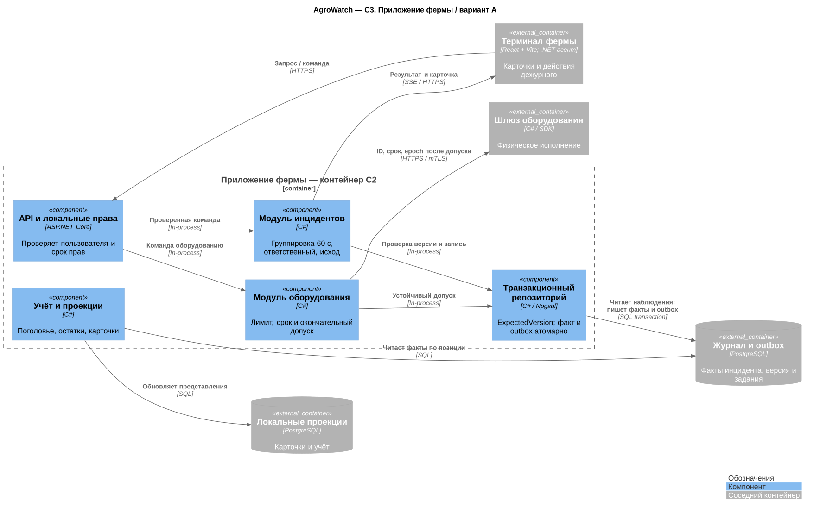
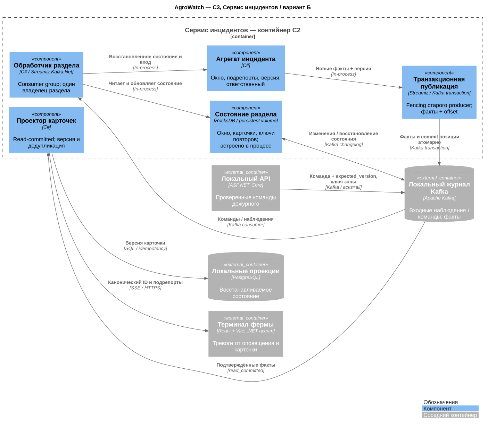
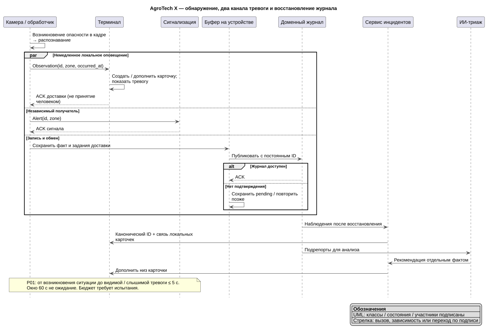
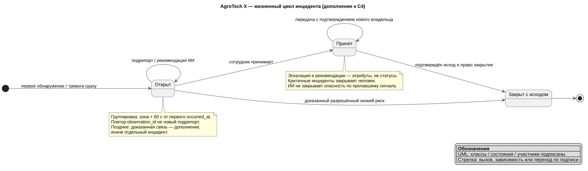
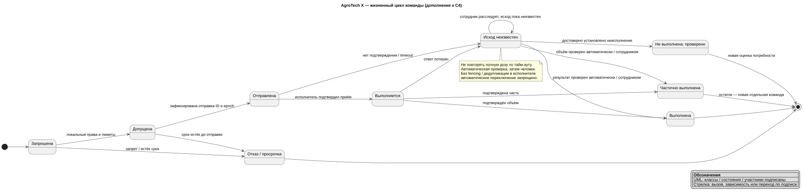

# Компоненты, код и динамика

## Область детализации

C3 в обоих вариантах раскрывает **контейнер «Видеоаналитика»** из [C2](../Task2/architecture.md). C4 раскрывает его **компонент «Издатель наблюдений»**. Глубина одинакова, доменная семантика общая; адаптер истории различается.

Уровень C4 использует типы и асинхронные интерфейсы C#/.NET. Это проект классов, не готовая реализация; имена JSON-полей определены отдельно контрактами.

## Вариант А

[PNG](diagrams/c3-variant-a.png) · [PlantUML](diagrams/c3-variant-a.puml)

[PNG](diagrams/c4-variant-a.png) · [PlantUML](diagrams/c4-variant-a.puml)

## Вариант Б

[PNG](diagrams/c3-variant-b.png) · [PlantUML](diagrams/c3-variant-b.puml)

[PNG](diagrams/c4-variant-b.png) · [PlantUML](diagrams/c4-variant-b.puml)

## Где различаются доменные обработчики

В А инциденты, допуск и учёт — модули одного приложения с транзакцией PostgreSQL. В Б сервис инцидентов распределяет вход по ключу зоны; consumer group назначает одного обработчика, факты и позиция фиксируются транзакционно, прежний producer отсекается. Подтверждение приёма HTTP-команды ещё не означает принятие инцидента: UI ждёт соответствующего доменного факта. В Б недоступность Kafka задерживает новые сигналы; ранее полученные остаются видимыми.

[PNG](diagrams/c3-incidents-a.png) · [PlantUML](diagrams/c3-incidents-a.puml)

[PNG](diagrams/c3-incidents-b.png) · [PlantUML](diagrams/c3-incidents-b.puml)

## Динамика тревоги

[PNG](diagrams/alert-dynamics.png) · [PlantUML](diagrams/alert-dynamics.puml)

В Б наблюдение сохраняется в локальный буфер и сразу публикуется в Kafka. Две группы оповещения доставляют его терминалу и сирене независимо. При недоступности кластера доставка новых тревог задерживается; прямого обхода нет. ACK журнала, ACK получателя и принятие человеком — три разных факта. Никакой второй результат модели не блокирует первый сигнал.

Терминал хранит локальный ID карточки и все observation_id. После восстановления журнала сервис инцидентов присылает canonical_id и список связанных наблюдений; UI объединяет представления по этим ссылкам. При неоднозначности сохраняются разные карточки.

## Дополнительные доменные модели

[PNG](diagrams/c4-incident.png) · [PlantUML](diagrams/c4-incident.puml)

[PNG](diagrams/c4-equipment.png) · [PlantUML](diagrams/c4-equipment.puml)

## Назначение камер и владение командами

Версионированное назначение каждой камеры трём разным узлам хранится в подписанной конфигурации и локальном кэше. Последняя работающая копия не останавливается ради балансировки. Изменение назначения выполняется make-before-break: новый обработчик подтверждает свежие кадры, затем снимается старый. Два отказа не требуют перестроения ради покрытия: третья копия уже работает. Контроллер развёртывания меняет конфигурацию вне пятисекундного пути; потеря центра не отзывает действующее назначение.

В Б инциденты имеют одного активного writer на ключ зоны/агрегата через consumer group, транзакционный producer fencing и проверку версии. Реализация должна атомарно публиковать факты и commit позиции. Для физической команды этого мало: шлюз проверяет срок lease и монотонный epoch, хранит command_id. Перед failover выдаётся новый epoch из единственного устойчивого реестра допуска; если этот реестр недоступен, допуск приостанавливается. Старый epoch отвергается исполнителем/шлюзом. Без такой поддержки автоматический failover оборудования не допускается; неизвестный исход проверяют, не повторяют полную дозу.

Проекционная БД Б может восстанавливаться на живом узле; до этого UI показывает наблюдения от сервиса оповещения и помечает неподтверждённые действия.

## Трассировка

| Требования | Элемент |
|---|---|
| F01–F02, R01, P01, C02–C05 | C3 захват → модель → издатель; Б: Kafka → оповещение → два получателя |
| F03–F04, F09 | Состояния команды, lease/epoch, локальные права |
| F05–F08, P02 | Доменная история и проекции в C2; publisher в C4 |
| R02, C01, S01 | Размещение Task1, тесты отказов; не доказанный SLO |

Захват нормализует timestamps и диагностирует устаревшие кадры. Адаптер модели применяет калибровку fisheye и preprocessing, согласованный с поставщиком. Ночь, тени и похожие животные входят в размеченный набор приёмки. RTSP — допущение для IP-камер; для иного протокола нужен адаптер, а не обещание универсальной совместимости. Обновление модели версионируется, развёртывается по одной копии с rollback; нельзя одновременно обновить все три обработки камеры.
